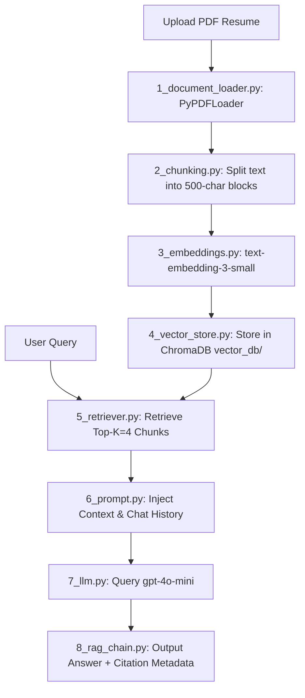

# 📄 Modular Resume Reader RAG Chatbot

A production-quality, modular **Retrieval-Augmented Generation (RAG)** chatbot designed specifically to read, parse, index, and answer questions about an uploaded PDF resume. The application is built using **Python 3.11, Streamlit, LangChain, OpenAI APIs (GPT-4o-mini & Text Embeddings), and ChromaDB** as a persistent local vector database.

This RAG application enforces a **strict zero-hallucination policy**: it answers questions **only** based on the contents of the uploaded resume. If the information is unavailable, it returns exactly: 
> `"I couldn't find this information in the uploaded resume."`

---

## 🌟 Key Features

- **Modular RAG Architecture:** Standardized directories separating document loaders, chunking mechanisms, embeddings, databases, and inference orchestration.
- **Dynamic File Processing:** Accepts PDF resumes, automatically clears any previous files, and rebuilds the vector index on-the-fly.
- **Premium Streamlit UI:** Stunning custom typography (Outfit), CSS gradient titles, glassmorphism-styled stats cards, interactive question chips, and polished micro-animations.
- **Source Attribution:** Interactive citation rendering that marks exactly which document pages and snippets were referenced.
- **Debug Explorer:** Optional "Show Retrieved Chunks" toggle to inspect the exact textual chunks returned by similarity search.
- **Stateful Memory:** Conversational history tracker allowing continuous contextual dialogues.
- **Performance Auditing:** Embedded timing metrics capturing execution latency for parsing and query execution.

---

## 📁 Repository Structure

```
Resume-RAG/
│
├── app.py                     # Streamlit frontend layout & state orchestration
├── config.py                  # Environment configuration and API validations
├── requirements.txt           # Python packages and dependencies
├── README.md                  # Detailed project overview and installation guide
├── .env.example               # Template environment configuration file
├── .env                       # Local configurations (contains OpenAI API key)
│
├── uploads/                   # Local folder to cache uploaded PDF resumes
├── vector_db/                 # ChromaDB sqlite and block files storage
│
├── pipeline/
│   ├── __init__.py
│   ├── 1_document_loader.py   # PDF text extraction (PyPDFLoader)
│   ├── 2_chunking.py          # Document chunking (RecursiveCharacterTextSplitter)
│   ├── 3_embeddings.py        # Embeddings generation (text-embedding-3-small)
│   ├── 4_vector_store.py      # Vector DB transactions (ChromaDB init & clear)
│   ├── 5_retriever.py         # Similarity search retriever configuration
│   ├── 6_prompt.py            # RAG instruction templates & memory config
│   ├── 7_llm.py               # OpenAI LLM client initialization (gpt-4o-mini)
│   └── 8_rag_chain.py         # Complete LangChain RAG pipeline assembly (LCEL)
│
└── utils/
    ├── __init__.py
    ├── logger.py              # Centralized logging configuration
    └── timer.py               # Pipeline execution timing context manager
```

---

## 🛠️ Step-by-Step RAG Pipeline Flow



1. **Upload & Extract:** The user uploads a PDF. `1_document_loader.py` triggers LangChain's `PyPDFLoader` to read the PDF structure, returning page-by-page document segments.
2. **Recursive Splitting:** `2_chunking.py` splits pages using `RecursiveCharacterTextSplitter` into chunks of **500 characters** with an overlap of **100 characters** to ensure semantic continuity across split boundaries.
3. **Embeddings Generation:** `3_embeddings.py` passes the text chunks to OpenAI's high-performance `text-embedding-3-small` model, converting them into 1536-dimensional vector embeddings.
4. **Local Vector Storage:** `4_vector_store.py` writes the vectors and document metadata into the local `vector_db/` directory utilizing `ChromaDB`.
5. **Contextual Retrieval:** `5_retriever.py` formats a vector query using cosine similarity to extract the **top 4 most relevant chunks** matching the user query.
6. **Prompt Synthesis:** `6_prompt.py` wraps the chunks, conversational history, and user question within a strict prompt instructing the model to return a standardized string if information is not found.
7. **LLM Execution:** `7_llm.py` routes the payload to `gpt-4o-mini` with a temperature of `0.0` for highly deterministic, factual answers.
8. **Pipeline Orchestration:** `8_rag_chain.py` uses LangChain Expression Language (LCEL) to merge the elements, returning both the text response and the source document list to the interface.

---

## 🚀 Setup & Installation

### 1. Prerequisites
- Python 3.11.x installed on your local machine.
- An active OpenAI API account with API keys.

### 2. Clone the Repository
```bash
# Clone the repository
git clone <repository_url>
cd resume-rag
```

### 3. Install Dependencies
```bash
python -m pip install -r requirements.txt
```

### 4. Configure Environment Variables
Copy the `.env.example` file to `.env`:
```bash
cp .env.example .env
```
Open `.env` and enter your OpenAI API key:
```env
OPENAI_API_KEY=sk-proj-...
```

### 5. Run Verification Tests
Validate the modular setup and RAG pipeline configurations using Python's native `unittest`:
```bash
python -m unittest tests/test_pipeline.py
```

### 6. Start the Web App
Launch the Streamlit dashboard:
```bash
streamlit run app.py
```
The browser will automatically open at `http://localhost:8501`.

---

## 🔒 Error Handling & Defensiveness
- **Invalid PDFs:** Validates file signatures, raising clear UI warnings if parsing fails or if the file uploaded is not a PDF.
- **Empty Retrieval & Hallucination Defense:** If Chroma returns empty context or the LLM output contains phrases denoting missing information, the code overrides the output to strictly return `"I couldn't find this information in the uploaded resume."`
- **Missing API Keys:** Blocks app execution, displaying clear instructions on setting up environment variables.
